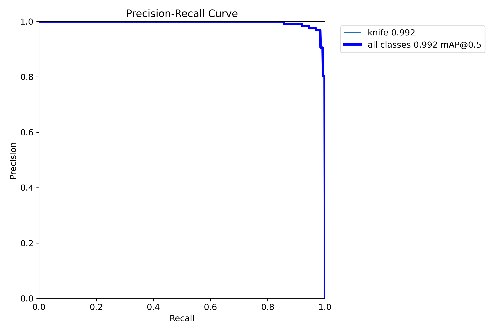
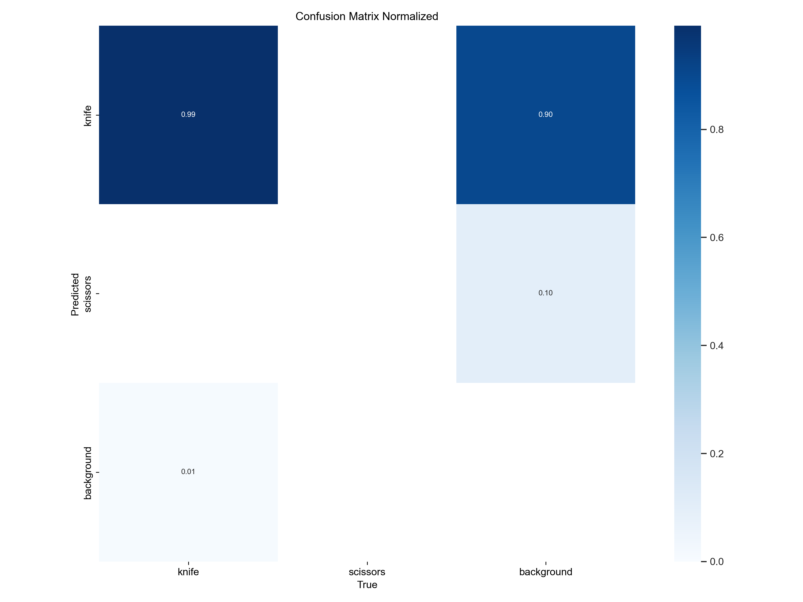
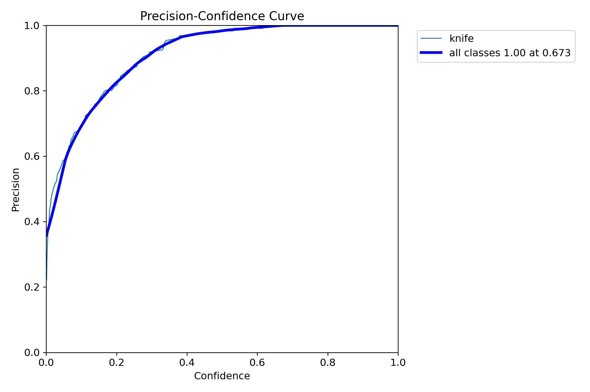
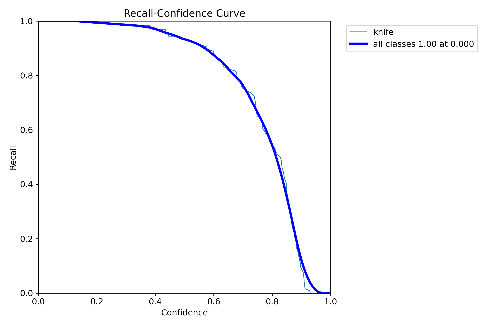
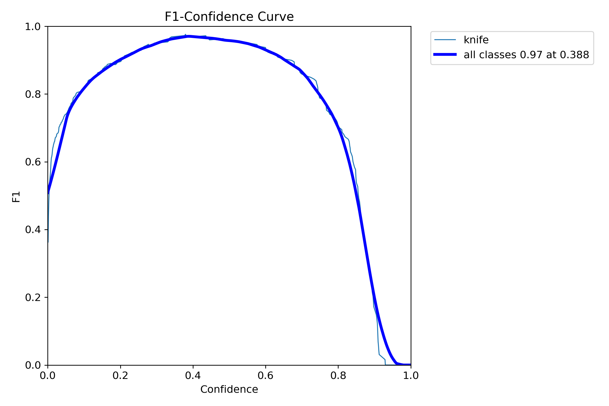
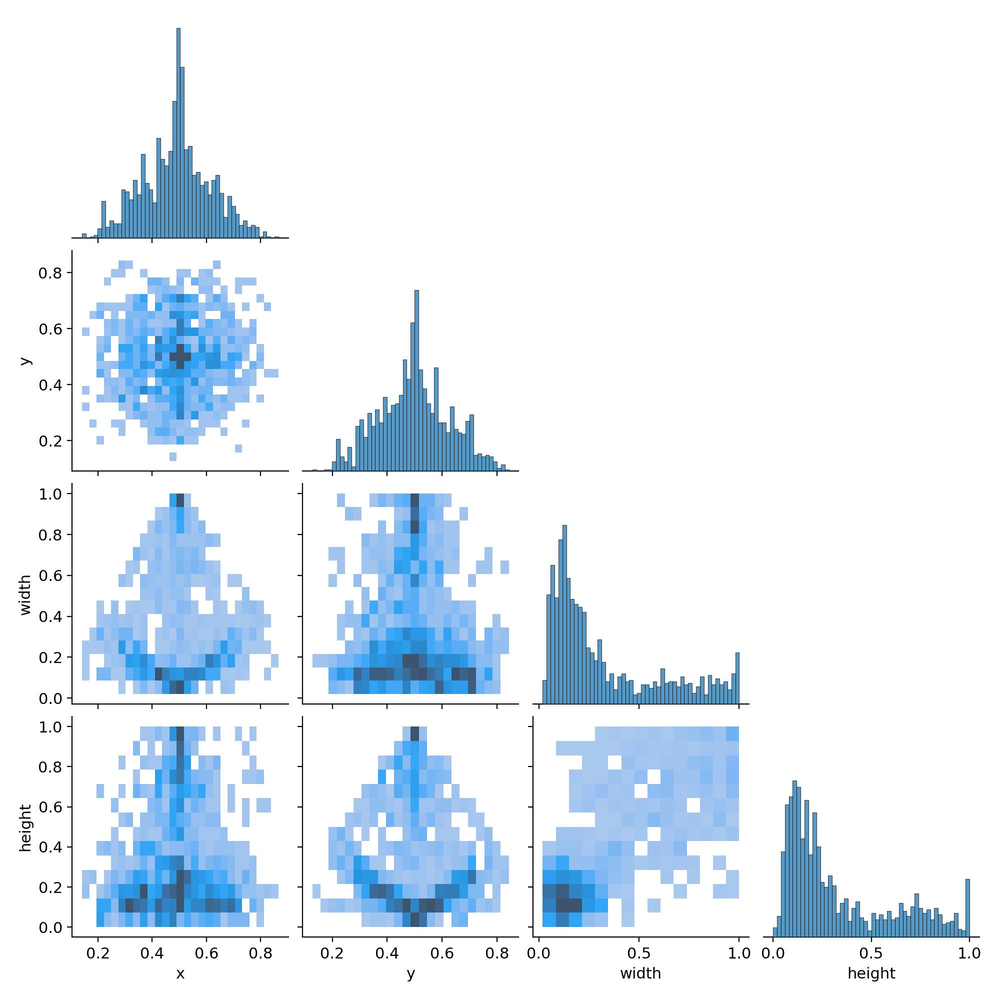

# 📘 Como executar inferencia

Edite o arquivo .env com suas credenciais para enviar notificação de email

```console
$ pip install -r requirements.txt
$ python anomaly-detection/inference.py <caminho video ou imagem>
```
# 📘 Documentação Técnica – MVP: Detecção de Objetos Cortantes

## 🏁 **Objetivo**
Desenvolver uma solução de IA para identificar objetos cortantes (usei somente facas, tesouras) em imagens e vídeos de câmeras de segurança, com foco em:

- Precisão na detecção
- Redução de falsos positivos
- Emissão de alertas em tempo real
- Interface leve e adaptável a ambientes diversos

---

## ⚙️ **Arquitetura e Tecnologias Utilizadas**

| Componente        | Descrição |
|-------------------|----------|
| 🧠 Modelo IA       | YOLOv8 (Ultralytics), arquitetura baseada em detecção em tempo real |
| 🖼️ Anotação        | Roboflow, com bounding boxes e classes `knife` e `scissors` |
| 💾 Dataset         | 800 imagens `scissors`, 490 `knife` + negativos |
| 🔧 Framework       | Python 3.12 + Ultralytics + OpenCV |
| ✉️ Alertas         | Console logging e estrutura pronta para envio de e-mail (SMTP) |
| 📊 Avaliação       | Matriz de confusão, curvas PR, F1, Precision-Confidence |
| 🎥 Suporte a input | Imagem única ou vídeo completo (.jpg/.mp4/etc.) |

---

## 🔄 **Fluxo de Desenvolvimento**

### **1. Dataset**
- Imagens coletadas e organizadas em `train/` e `valid/` com estrutura YOLO.
- Anotações realizadas no **Roboflow**, exportadas em formato YOLOv8.
- Aumentos de dados (augmentations) foram aplicados para:
  - Simular variações de iluminação, ângulo, ruído
  - Balancear a classe `knife` (menos representada)

### **2. Treinamento**
- Modelo base: `yolov8n.pt` (modelo leve para maior velocidade)
- Treinamento com:
  - **30 épocas**
  - Tamanho de imagem: **640x640**
  - Limiar de confiança padrão: `0.25` (avaliado depois via curvas)
- `data.yaml` configurado com 2 classes: `knife`, `scissors`

### **3. Validação**
- Realizada com conjunto separado (~20% do dataset)
- Métricas coletadas automaticamente com `model.val()`:
  - `mAP@0.5`: 0.992
  - Precision, Recall e F1 por confiança
- Resultados salvos em: `runs/detect/val/`

### **4. Pós-treinamento**
- Análise gráfica:
  - 📈 Curva PR
  - 🎯 Curvas Precision/Recall × Confiança
  - 🔁 Matriz de confusão (normalizada e absoluta)
  - 📊 Distribuição de bounding boxes (correlograma)

### **5. Inferência**
- Script único: `inference.py` com suporte a imagem ou vídeo
- A função `process_frame()` reutilizada em vídeo e imagem
- Uso de thresholds específicos por classe:
  - `knife`: 0.75
  - `scissors`: 0.55
- Janela com preview da detecção via OpenCV
- Alerta no console ou via e-mail com timestamp do frame

---
## 📊 **Resultados Quantitativos do Treinamento**

### ✅ **1. Curva Precision × Recall**



- **mAP@0.5** (mean Average Precision) = **0.992**
- **Classe `knife`**: AP = **0.992**
- **Classe `scissors`**: não apresentada na curva PR isoladamente, mas presente na matriz de confusão

🔍 **Conclusão**: O modelo apresenta altíssima precisão na detecção de facas, com recall igualmente elevado. Isso indica robustez em cenários de monitoramento real.

---

### ✅ **2. Matrizes de Confusão**

#### 🔄 Normalizada:


- `knife`: 125 verdadeiros positivos, apenas 1 falso negativo
- `scissors`: 18 verdadeiros positivos, 2 falsos negativos
- Nenhuma confusão cruzada (knife vs scissors)

🔍 **Conclusão**: Excelente separação entre classes. O modelo consegue distinguir corretamente objetos cortantes, mesmo em condições desafiadoras.

---

### ✅ **3. Curvas Precision × Confidence e Recall × Confidence**

#### 🎯 Precision vs Confidence:


- Melhor equilíbrio de precisão com threshold ≈ **0.67**

#### 🎯 Recall vs Confidence:


🔍 **Conclusão**: Threshold de confiança ideal está entre **0.65 e 0.7**, o que confirma a decisão de usar `0.75` para `knife` (alta exigência) e `0.55` para `scissors` (mais permissivo).

---

### ✅ **4. Curva F1 × Confidence**


- Melhor F1-score ≈ **0.97** ocorre com threshold ≈ **0.38**

🔍 **Conclusão**: O modelo apresenta ótimo equilíbrio entre precisão e recall até mesmo em níveis mais baixos de confiança, o que garante flexibilidade para aplicações com diferentes graus de tolerância a falsos positivos.

---

### 🧩 **5. Correlograma de Labels**



- Distribuição uniforme dos bounding boxes
- Centralização comum de objetos na imagem (o que é esperado em vídeos de segurança)

---

## ✅ **Justificativa Final da Qualidade do Modelo**

- O modelo YOLOv8 treinado alcançou desempenho **acima de 99% de precisão e recall** para a classe principal (`knife`)
- A classe `scissors`, apesar de menos representada, apresenta separação confiável, sem confusões cruzadas
- A configuração de thresholds por classe ajuda a **minimizar alarmes falsos** e **priorizar segurança**
- As curvas F1 e Precision/Recall indicam que o modelo é **confiável para aplicação prática em ambiente de vigilância**

---

## 🧪 **Testes com Vídeos da Hackathon**
- Vídeos fornecidos foram testados com `cv2.VideoCapture()` e suporte a múltiplos formatos
- O script identifica a extensão e adapta o fluxo automaticamente

---

## 🔔 **Sistema de Alerta**
- Implementação baseada em **classe abstrata `Alert`** para facilitar extensão futura
- Modo atual:
  - `ConsoleAlert`: logs no terminal/logfile
  - `EmailAlert`: estrutura pronta com `SMTP_SSL`
- Customizável para futura integração com: Telegram, Twilio, Discord, etc.

---

## 📦 **Repositório**
O projeto é estruturado da seguinte forma:

```
📁 dataset/
├── train/images/
├── train/labels/
├── valid/images/
├── valid/labels/
└── data.yaml

📁 runs/            ← onde os outputs do YOLO são armazenados
📄 inference.py     ← script principal de inferência
📄 evaluate.py      ← métricas e gráficos
📄 logs.log         ← logs de alertas

📄 README.md
```

---

## 🧠 **Decisões Técnicas Justificadas**

| Decisão | Justificativa |
|--------|---------------|
| YOLOv8 | Excelente desempenho para detecção em tempo real, com suporte oficial e exportação simples |
| Dois thresholds por classe | Evita falsos positivos em faca e mantém recall alto em tesoura |
| Roboflow | Acelera anotação manual e exportação compatível |
| OpenCV + `imshow` | Permite exibição ao vivo sem frameworks pesados |
| Alert abstrato | Facilita substituição por qualquer tipo de notificação futura |

---

## ✅ **Conclusão**
O MVP proposto atende aos requisitos da Hackathon:
- Identifica objetos cortantes (facas e tesouras) com precisão
- Emite alertas emails
- Suporta imagens e vídeos com flexibilidade de uso
